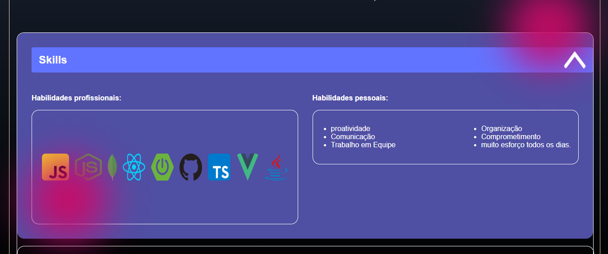
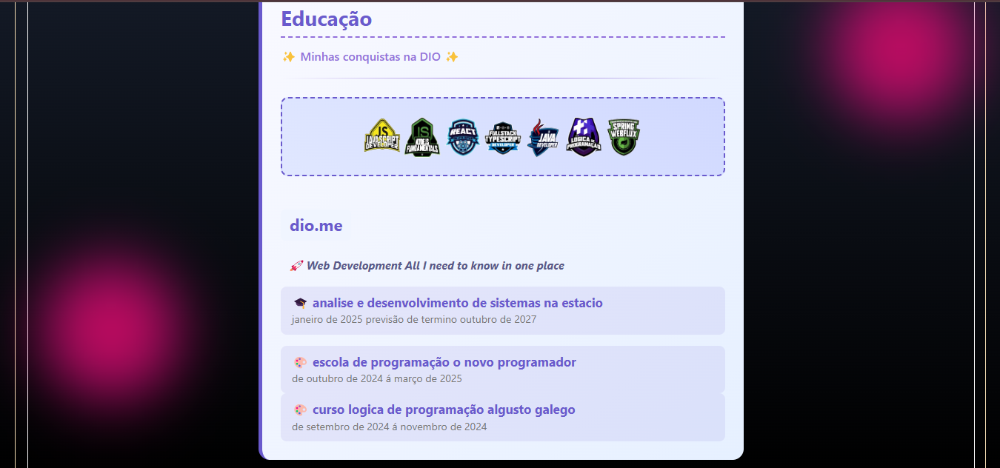
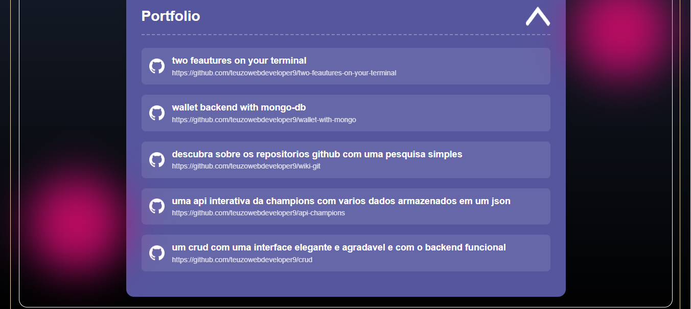
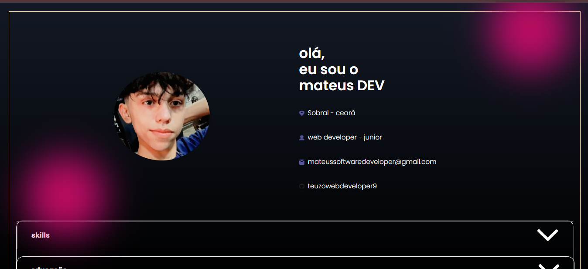

💼 Portfólio - Teuzo Web Developer
Seja muito bem-vindo(a) ao meu novo portfólio!
Aqui você pode explorar diferentes áreas da minha carreira de uma maneira moderna e envolvente. Esse projeto nasceu a partir de um desafio da plataforma DIO, mas eu fiz questão de colocar minha identidade, minha visão, e usar uma abordagem bem mais JavaScript para entregar uma experiência diferenciada a quem navega.

🧠 Sobre o projeto
Nesse portfólio, o HTML e o CSS são como o esqueleto e o estilo – eles dão forma e beleza.
Mas quem realmente traz vida, movimento e interatividade é o JavaScript, linguagem na qual venho me especializando com dedicação.

Sou um desenvolvedor muito esforçado, apaixonado por tecnologia, e que transita bem entre o dinamismo do JavaScript e o profissionalismo do Java.
Aqui você encontra:

📄 Meu currículo completo

💻 Alguns dos meus projetos mais interessantes

🌟 Uma visão clara da minha evolução como desenvolvedor

📢 Uma nova fase
Este portfólio representa uma grande virada. Estou deixando para trás, com carinho, o meu antigo site – que foi feito com muito esforço no começo da minha jornada – para evitar confusões com recrutadores e mostrar de forma transparente a minha evolução técnica e visual.

🙌 Convite
Se você chegou até aqui, muito obrigado!
Estou muito interessado em oportunidades como estágio ou desenvolvedor júnior.
Tenho muitas qualidades, sou proativo acima da média, e aprendo com muita rapidez.

Se você acredita que posso somar ao seu time, por favor entre em contato:

📧 mateussoftwaredeveloper@gmail.com

📸 Screenshots

🖥️ 
Feito com esforço 💻
by teuzowebdeveloper9